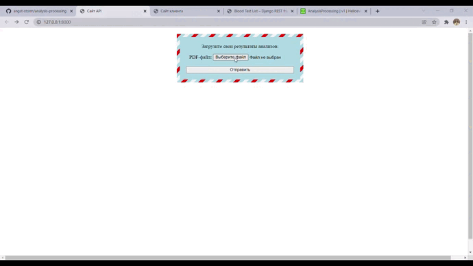

<h1 align="center">Обработка результатов анализов</h1>

---

<p align="center">
    
</p>

---

## Описание

Анализы, производимые разными лабораториями, не имеют единого стандарта, в наборе и наименовании показателей, поэтому
компьютерная обработка таких анализов часто очень затруднена.

Этот проект - встраиваемый веб сервис с архитектурой REST API и понятной и доступной документацией, который способен
загрузить документы (анализы крови), отправленные пользователем, распознать информацию из справок, обработать ее и
представить в едином табличном формате.

Решение поддерживает распознание общего анализа крови из пяти российских клиник (УГМК, Ситилаб, INVITRO, KDL, Гемотест).

[Демо-версия (не работает распознание)](https://analysis-processing.herokuapp.com/)

[Документация кода на OpenAPI (Swagger)](https://app.swaggerhub.com/apis-docs/Helloeverybody/AnalysisProcessing/v1)

[Видеодемонстрация работы](https://drive.google.com/file/d/1Vih9ApqK_UxRU7jcahNIi-K9i-1ui863/view?usp=sharing)

[Презентация проекта](https://docs.google.com/presentation/d/1CnPBpiwwcNVVtuXKCdmj9msKJIguBHL1/edit?usp=sharing&ouid=109201286991509934446&rtpof=true&sd=true)

[Telegram-канал, посвященный разработке](https://t.me/changelogforanalises)

## Демонстрация



## О проекте

### Взаимодействие с API:

#### Административная панель

- Переход по [/admin/](https://analysis-processing.herokuapp.com/admin/)

#### Получение результатов парсинга в ответе (возможна задержка)

- Метод GET (Адрес: [/](https://analysis-processing.herokuapp.com/)) или переход
  по [/](https://analysis-processing.herokuapp.com/):
  Форма с полем для отправки PDF
- Метод POST (Поля: {client_file: файл}; Адрес: [/](https://analysis-processing.herokuapp.com/)) или отправка формы:
  Результат парсинга отправленного PDF

#### Получение результатов парсинга по id

- Метод GET ([/blood-tests/](https://analysis-processing.herokuapp.com/blood-tests/)) или переход по адресу вернет
  список PDF файлов, результат парсинга которых сохранен в базу данных
- Метод POST (Поля: {client_file: файл}, Адрес: [/blood-tests/](https://analysis-processing.herokuapp.com/blood-tests/))
  вернет ID результатов парсинга отправленного PDF
- Метод GET ([/blood-tests/id/](https://analysis-processing.herokuapp.com/blood-tests/id/)) или переход по адресу вернет
  результат парсинга PDF файла (хранящийся по ID)

### Виджеты

Код для вставки виджета на страницу:

```html

<div id="unique-id"></div>
<script src="https://analysis-processing.herokuapp.com/static/widget.js" type="text/javascript"></script>
<script type="text/javascript">
    widgetManager.init("unique-id");
</script>
```

При желании, `unique-id` можно заменить на любой другой уникальный id _(заменить необходимо в обоих местах)_.

Для взаимодействия с результатом работы API в объекте widgetManager предусмотрен метод actionWithResult(res),
принимающий на вход десериализованный объект ответа. Достаточно переопределить этот метод объекта _(по умолчанию метод
выводит всплывающее окно alert с результатом парсинга)_.

Структура проекта:

- __restapi__ _- директория, содержащая весь основной код Django REST API_
    - __api__ _- раздел, содержащий интерфейсы взаимодействия пользователя с API_
    - __parsers__ _- раздел, содержащий код парсера документов и вспомогательные функции_
    - __restapi__ _- раздел, содержащий файлы, необходимые для работы Django_
- __client_site__ _- директория, содержащая небольшой одностраничный сайт, необходимый для отладки и демонстрации работы
  виджетов_

## Запуск

### Установка ПО, необходимого для работы парсера

#### Tesseract

1. Скачать установщик [здесь](https://github.com/UB-Mannheim/tesseract/wiki)
2. Установить в папку `analysis-processing\restapi\parsers\tesseract`

#### Poppler

1. Скачать архив по [ссылке](https://drive.google.com/u/0/uc?id=1WU8SBkhBv_wx-dcNvztpaONI3_N29Cnj&export=download)
2. Распаковать в папку `analysis-processing\restapi\parsers`

#### Java

1. Установить себе на ПК Java, скачанную по [ссылке](https://www.java.com/en/download/manual.jsp)
2. В PATH указать путь до папки bin (в директории с Java)

### Запуск API на локальном хосте

1. Открыть проект
2. Назначить или сгенерировать виртуальную область Python, установить зависимости из `requirements.txt`.
3. В папку `analysis-processing` положить файл с виртуальными
   переменными `.env` _[(скачать архив с файлом)](https://drive.google.com/u/0/uc?id=1gsw5wDbTpERr7nzqO7T6s1xSo25ktasv&export=download)_
   .

#### Команды для терминала Python:

1. `cd restapi` _(переход в папку restapi)_
2. `python manage.py migrate` _(создается база данных и внутри ее генерируются необходимые таблицы)_
3. `python manage.py collectstatic` _(собирает все статические файлы в одну папку)_
4. `python manage.py createsuperuser` _(запускается процесс регистрации пользователя, в следующих полях введите ник,
   почту и пароль)_
5. `python manage.py runserver` _(запуск сервера)_

### Тесты

`python manage.py test` _(запуск тестов для моделей хранения данных и представления API)_

### Запуск контейнера Docker

1. Установить [Docker Desktop](https://hub.docker.com/editions/community/docker-ce-desktop-windows)
2. Ввести команду `docker-compose -f docker-compose.yml up -d`

При упаковке контейнера Java, Python, Tesseract и Poppler загружаются автоматически, поэтому нужно удалить указания
путей к Tesseract и Poppler в файле ./restapi/parsers/tesseract_parser.py Сами Tesseract и Poppler так же можно удалить,
в контейнере они не понадобятся